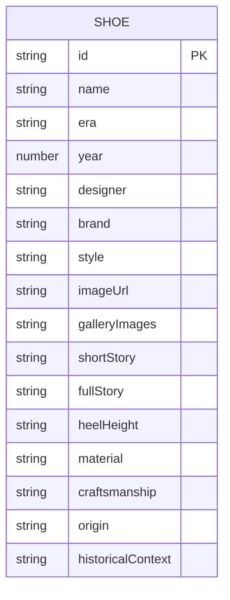

## 1. 架构设计

```mermaid
flowchart TD
    "浏览器前端 (React)" --> "Vite 开发服务器"
    "浏览器前端" --> "Express API 服务器"
    "Express API 服务器" --> "高跟鞋数据模块 (Mock Data)"
    "Vite 开发服务器" --> "静态资源 (CSS/JS/图片)"
```

## 2. 技术说明

- **前端框架**：React@18 + TypeScript
- **构建工具**：Vite@5
- **样式方案**：Tailwind CSS@3
- **路由管理**：react-router-dom@6
- **状态管理**：zustand
- **图标库**：lucide-react
- **后端框架**：Express@4 + TypeScript
- **数据方案**：前端通过 Express 提供 REST API，使用 Mock 数据（高跟鞋展品数据）
- **初始化工具**：vite-init（react-express-ts 模板）

## 3. 路由定义

| 路由 | 用途 |
|-------|---------|
| `/` | 首页 - 博物馆大厅，展示高跟鞋卡片墙和年代导航 |
| `/shoe/:id` | 详情页 - 展品展厅，展示单只高跟鞋的详细资料 |

## 4. API 定义

### 4.1 类型定义

```typescript
interface Shoe {
  id: string;
  name: string;
  era: string;
  year: number;
  designer: string;
  brand: string;
  style: string[];
  imageUrl: string;
  galleryImages?: string[];
  shortStory: string;
  fullStory: string;
  specs: {
    heelHeight: string;
    material: string;
    craftsmanship: string;
    origin: string;
  };
  historicalContext: string;
}
```

### 4.2 API 接口

| 方法 | 路径 | 描述 | 响应 |
|------|------|------|------|
| GET | `/api/shoes` | 获取所有高跟鞋列表（支持 era 和 style 查询参数筛选） | `Shoe[]` |
| GET | `/api/shoes/:id` | 获取单只高跟鞋的详细资料 | `Shoe` |

### 4.3 请求/响应示例

**GET /api/shoes**

响应：
```json
[
  {
    "id": "1920s-french-pump",
    "name": "法式浅口鞋",
    "era": "1920s",
    "year": 1925,
    "designer": "André Perugia",
    "brand": "Maison Perugia",
    "style": ["经典", "法式", "Art Deco"],
    "imageUrl": "...",
    "shortStory": "咆哮的二十年代，女性解放与爵士时代的标志性鞋款..."
  }
]
```

**GET /api/shoes/1920s-french-pump**

响应：
```json
{
  "id": "1920s-french-pump",
  "name": "法式浅口鞋",
  "era": "1920s",
  "year": 1925,
  "designer": "André Perugia",
  "brand": "Maison Perugia",
  "style": ["经典", "法式", "Art Deco"],
  "imageUrl": "...",
  "galleryImages": ["...", "..."],
  "shortStory": "咆哮的二十年代，女性解放与爵士时代的标志性鞋款...",
  "fullStory": "1920年代是女性解放的黄金时期...",
  "specs": {
    "heelHeight": "5cm",
    "material": "真丝缎面 + 小牛皮",
    "craftsmanship": "手工缝制鞋面，法国利摩日瓷扣装饰",
    "origin": "法国巴黎"
  },
  "historicalContext": "一战结束后..."
}
```

## 5. 服务器架构图

```mermaid
flowchart TD
    "路由层 (Routes)" --> "服务层 (Services)"
    "服务层 (Services)" --> "数据层 (Data)"
    "数据层 (Data)" --> "Mock 数据模块"
```

- **路由层**：`api/routes/shoes.ts` - 定义 API 路由和请求处理
- **服务层**：`api/services/shoeService.ts` - 业务逻辑（筛选、查询）
- **数据层**：`api/data/shoes.ts` - Mock 高跟鞋数据

## 6. 数据模型

### 6.1 数据模型定义



### 6.2 前端目录结构

```
src/
├── components/
│   ├── ShoeCard.tsx          # 高跟鞋卡片组件
│   ├── EraNav.tsx            # 年代导航组件
│   ├── Header.tsx            # 页头标题组件
│   └── BackButton.tsx        # 返回按钮组件
├── pages/
│   ├── Home.tsx              # 首页
│   └── ShoeDetail.tsx        # 详情页
├── hooks/
│   └── useShoes.ts           # 数据请求 hook
├── utils/
│   └── api.ts               # API 请求封装
├── types/
│   └── index.ts             # 类型定义
├── store/
│   └── useShoeStore.ts       # 状态管理
├── App.tsx
├── main.tsx
└── index.css
```

### 6.3 后端目录结构

```
api/
├── index.ts                 # Express 服务入口
├── routes/
│   └── shoes.ts             # 高跟鞋 API 路由
├── services/
│   └── shoeService.ts       # 鞋履数据服务
└── data/
│   └── shoes.ts           # Mock 数据
└── shared/
    └── types.ts           # 共享类型定义
```
